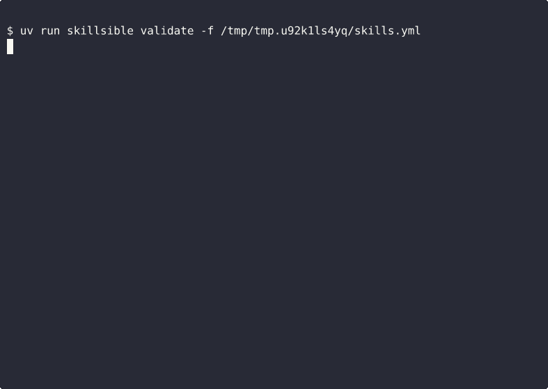

# skillsible

Ansible-style skill management for Codex, Claude Code, and agent CLIs.

[](docs/demo.md)

## What It Does

`skillsible` manages agent setup declaratively across machines and agents.

- define desired skills, tools, and MCPs in a manifest
- target multiple agent CLIs
- preview changes with `plan`
- apply supported installs idempotently
- make workstation setup reproducible

## MVP

The current version has three manifest layers:

- `skills`
  Portable `SKILL.md`-style agent skills. This is the most mature layer and the one `apply` supports today.
- `tools`
  Shared machine tools such as LSPs or CLIs. These are parsed and shown in `plan`, and selected installers are supported in `apply`.
- `mcps`
  MCP server definitions. These are parsed, shown in `plan`, and configured through supported agent CLIs in `apply`.

This split is intentional. Skills are the cleanest cross-agent abstraction. Tools and MCPs vary more by agent and runtime, so `skillsible` tracks them explicitly without pretending parity that does not exist.

## Complete Schema Example

```yaml
version: 1  # Manifest format version

agents:
  - codex       # Default target agent
  - claude-code # Also receives any skill that does not override `agents`

defaults:
  scope: global # Default scope: install for the current user across projects

skills:
  - source: obra/the-elements-of-style
    skill: writing-clearly-and-concisely # Required: skill directory name
    version: v1.2.0 # Optional: branch, tag, or commit SHA
    # No `agents` field here, so this inherits both top-level agents:
    #   - codex
    #   - claude-code
    # No `scope` field here, so this inherits `defaults.scope = global`

  - source: obra/the-elements-of-style
    skill: writing-clearly-and-concisely
    version: main # A skill version can be a branch, tag, or commit SHA
    agents:
      - codex # Optional override: target only codex
    scope: project # Optional override: install only for the current project

tools:
  - name: pyright
    kind: lsp # Required: free-form category like lsp or cli
    source:
      npm:
        package: pyright
        version: 1.1.399
    verify:
      command: pyright
      args:
        - --version

  - name: ruff
    kind: cli
    source:
      uv:
        package: ruff
        version: 0.13.0
    verify:
      command: ruff
      args:
        - --version

mcps:
  - name: github
    transport: stdio # Optional: transport hint such as stdio, http, or sse
    command: github-mcp # Required for stdio MCPs
    args:
      - --serve
    env:
      GITHUB_TOKEN: ${GITHUB_TOKEN}
    agents:
      - claude-code

  - name: linear
    transport: http
    url: http://localhost:8765/mcp # Required for HTTP/SSE MCPs
    bearer_token_env_var: LINEAR_TOKEN # Optional: Codex bearer token env hook
```

## Schema Reference

Top-level `version` and per-skill `version` mean different things:

- top-level `version`
  The manifest schema version. This tells `skillsible` how to interpret the playbook itself.

- per-skill `version`
  The source revision to install for that skill. This is used for reproducibility and can be:
  - a semantic tag like `v1.2.0`
  - a git tag like `release-2026-03`
  - a branch like `main`
  - a commit SHA like `8c1f2d4`

When a per-skill `version` is set, `skillsible` resolves that source to a concrete git checkout before
calling `npx skills add ...`. This keeps `apply` reproducible even though `skills.sh` does not expose its
own documented `--ref` flag.

Recommended usage:

- use a branch for moving development targets
- use a tag for readable pinned versions
- use a commit SHA for exact replayability

### Top-level fields

- `version`
  Required. Manifest schema version. Current value: `1`.
- `agents`
  Required. Default target agents used by `skills`, `tools`, and `mcps` when an item does not define its own `agents`.
- `defaults`
  Optional. Currently only `defaults.scope` is supported.

### `skills`

Each `skills` entry supports:

- `source`
  Required. GitHub shorthand, GitHub URL, git URL, or local path containing the skill.
  Preferred GitHub form: `owner/repo` instead of `https://github.com/owner/repo`.
- `skill`
  Required. Skill directory name to install from that source.
- `agents`
  Optional. Overrides top-level `agents` for this skill only.
- `scope`
  Optional. `global` or `project`. Defaults to `defaults.scope` or `global`.
- `version`
  Optional. Branch, tag, or commit SHA. When set, `apply` resolves the source to that exact revision before installation.

### `tools`

Each `tools` entry supports:

- `name`
  Required. Human-readable tool name.
- `kind`
  Required. Free-form category such as `lsp` or `cli`.
- `agents`
  Optional. Overrides top-level `agents` for this tool only.
- `source`
  Required. Explicit installer backend. Supported forms today:
  - `uv.package`
  - `npm.package`
  - `go.package`
  - `cargo.package`
- `verify`
  Required. Post-install verification command and optional arguments.

Tool behavior in `apply`:

- `source.uv`
  Runs `uv tool install <package>` and then the verification command
- `source.npm`
  Runs `npm install -g <package>` and then the verification command
- `source.go`
  Runs `go install <package>@<version-or-latest>` and then the verification command
- `source.cargo`
  Runs `cargo install <package>` with optional `--version`, then the verification command

### `mcps`

Each `mcps` entry supports:

- `name`
  Required. MCP server name.
- `agents`
  Optional. Overrides top-level `agents` for this MCP only.
- `transport`
  Optional. Transport hint such as `stdio`, `http`, or `sse`. Defaults to `stdio` for command-based MCPs and `http` for URL-based MCPs.
- `command`
  Required for stdio MCPs. Command used to launch the MCP server.
- `args`
  Optional. Additional command arguments for stdio MCPs.
- `env`
  Optional. Environment variables for stdio MCPs.
- `headers`
  Optional. HTTP headers for MCP configuration. Applied for Claude Code and ignored for Codex, because the Codex CLI does not expose a generic header flag.
- `url`
  Required for HTTP/SSE MCPs. URL for an already-running MCP server.
- `bearer_token_env_var`
  Optional. Environment variable name for HTTP bearer authentication. Applied directly in Codex; resolved into an `Authorization` header for Claude Code.

MCP behavior in `apply`:

- `transport=stdio`
  Runs `codex mcp add <name> -- <command>...` or `claude mcp add --transport stdio <name> -- <command>...`
- `transport=http|sse`
  Runs the corresponding agent HTTP MCP add command using the configured URL
- `headers`
  Passed through to Claude Code. Retained in the manifest and lockfile for Codex, but omitted during `codex mcp add` because the CLI rejects arbitrary header flags.
- existing MCPs with the same name
  Are removed and re-added so the config is reconciled instead of duplicated

## Current Support

- `skills`
  Fully supported in `plan` and `apply`
- `tools`
  Supported in `plan` and `apply` for `uv`, `npm`, `go`, and `cargo` sources with explicit verification
- `mcps`
  Supported in `plan` and `apply` for Codex and Claude Code

## CLI

```bash
uv run skillsible validate -f skills.yml
uv run skillsible lock -f skills.yml
uv run skillsible diff -f skills.yml -l skillsible.lock
uv run skillsible plan -f skills.yml
uv run skillsible plan -f skills.yml -l skillsible.lock
uv run skillsible apply -f skills.yml
uv run skillsible apply -f skills.yml -l skillsible.lock
uv run skillsible doctor
uv run skillsible inspect
```

Machine-readable output is available for validation and inspection workflows:

```bash
uv run skillsible validate --json -f skills.yml
uv run skillsible lock --json -f skills.yml
uv run skillsible diff --json -f skills.yml -l skillsible.lock
uv run skillsible plan --json -f skills.yml
uv run skillsible inspect --json
```

`skillsible lock` writes a normalized `skillsible.lock` file with:

- the source manifest path
- the current `skillsible` version
- resolved skill revisions when the source can be resolved through git
- normalized snapshots of `tools` and `mcps`

This is groundwork for reproducibility. The lockfile is generated today, but `apply` does not yet
consume every field. Current lockfile support includes:

- `plan -l skillsible.lock`
- `apply -l skillsible.lock`
- `validate -l skillsible.lock`
- `diff -l skillsible.lock`

When a lockfile is applied, `skillsible` prefers the locked skill revision and resolved source when
present.

`inspect` is the current post-install verification command for supported agents. It queries real
local CLIs instead of guessing from manifest state:

- `npx skills ls ...` for Codex and Claude skill discovery
- `codex mcp list` for Codex MCP discovery
- `claude plugins list` and `claude mcp list` for Claude discovery

This is stronger than a dry-run or command log because it asks the agent surfaces what they
currently see after installation. It still has a support boundary:

- `skills`
  Verified through `skills.sh` discovery
- `tools`
  Verified separately through their installed binaries
- `mcps`
  Applied through `codex mcp add` and `claude mcp add`; `inspect` verifies current runtime discovery
- `lockfile`
  Generated by `skillsible lock`; consumed for skill planning/apply via `-l/--lockfile`

See [SUPPORT_MATRIX.md](/home/srikalyan.swayampakula/workspaceGithub/skillsible/SUPPORT_MATRIX.md) for the explicit feature-by-feature support table.

## Install

From PyPI:

```bash
uv tool install skillsible
skillsible doctor
```

For a specific version:

```bash
uv tool install skillsible==1.2.0
skillsible doctor
```

From a checkout:

```bash
uv tool install .
skillsible doctor
```

From a built wheel:

```bash
uv build
uv tool install dist/skillsible-1.2.0-py3-none-any.whl
skillsible doctor
```

## Design Goals

- declarative desired state
- multi-agent support
- idempotent operations
- portable across machines
- extensible adapter model

## Near-Term Roadmap

- agent adapters
- drift detection
- lockfile support
- export current installed skills
- lockfile consumption for exact resolved commits
- tool installers and bootstrap support
- richer MCP auth/config support across agents

## Development

```bash
uv sync --dev
uv run pytest
uv run skillsible validate -f examples/stack.yml
uv run skillsible plan -f examples/skills.yml
```

## Demo

See [`docs/demo.md`](docs/demo.md).
